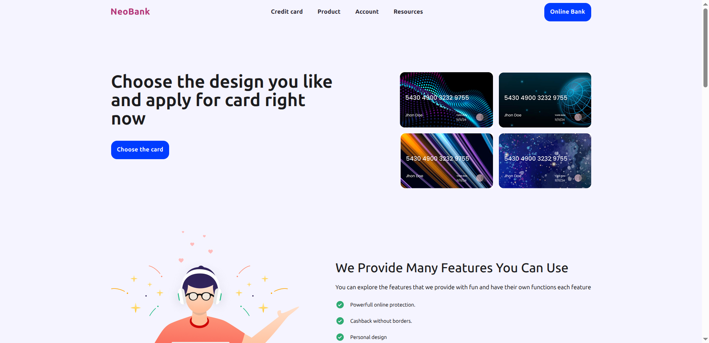

# neobank-app

Проектное задание Neoflex

## Обзор

### Главная страница



### Мобильная версия


## Демо

Попробуйте приложение: [Github Pages](https://sieiv.github.io/neobank-app/)

## Технологии

### База

- `React 19` - Основная библиотека
- `TypeScript` - Типизация
- `Vite` - Сборщик
- `React Router` - Маршрутизация
- `SASS` - CSS препроцессор
- [`neobank-ui-kit`](https://github.com/SIeiv/neobank-ui-kit) - Самописная ui библиотека

### Инструменты разработки

- `ESLint` - Линтер
- `Prettier` - Форматирование кода
- `Lint Staged` - автопроверка и автоформатирование кода при коммитах
- `gh-pages` - деплой на Github pages

## Установка и запуск

### Клонирование репозитория

```bash
git clone https://github.com/SIeiv/neobank-app
cd neobank-app
```

### Установка зависимостей

```bash
# npm
npm install

# yarn
yarn install

# pnpm
pnpm install
```

> ⚠️ **Внимание:** Если на Windows при установке зависимостей или во время разработки возникают ошибки - удалить скрипт postinstall в package.json

### Запуск в режиме разработки

```bash
npm run dev
```
